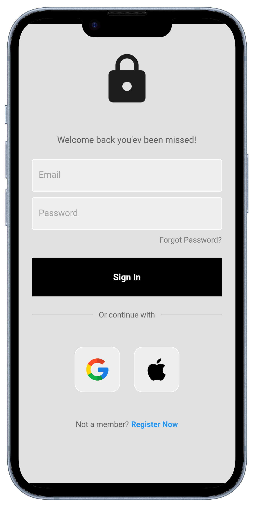
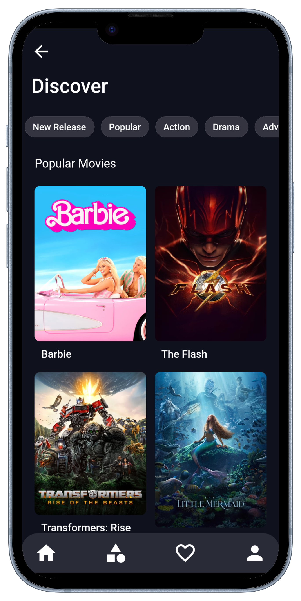
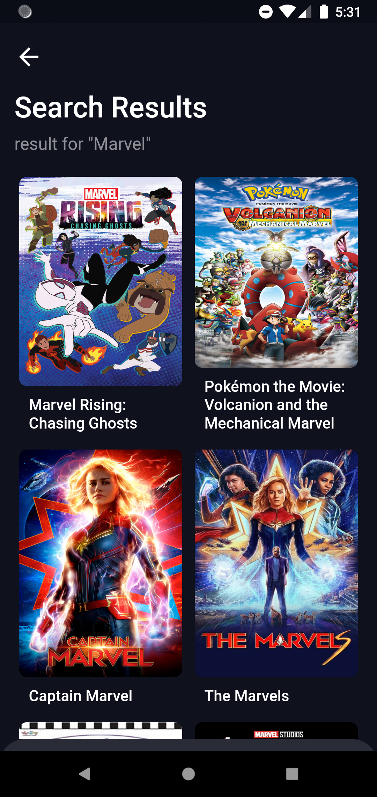

# Dev NOTES:

### Error to Fix

1. User page when using google register

### On Going

0. Fix some errors and bugs
1. Implement a video player that allows users to stream movies and TV shows.
99. Add some features

### Done task

1. Create a login page where users can sign up or log in to their account.
2. Create a dashboard where users can browse movies and TV shows.
3. Implement a search feature that allows users to search for movies and TV shows by title, genre, or actor.
4. Create a details page for each movie or TV show that displays information such as the plot summary, cast, and crew.
5. Use a public movie API such as TMDB1 to get movie data such as titles, descriptions, posters, and trailers.
6. Update user details

# streamlt

An Application for streaming movies.

  

    <h2>Login UI</h2>
     
    
    
  

  

    <h2>Home UI</h2>
     
    
    
    
  

